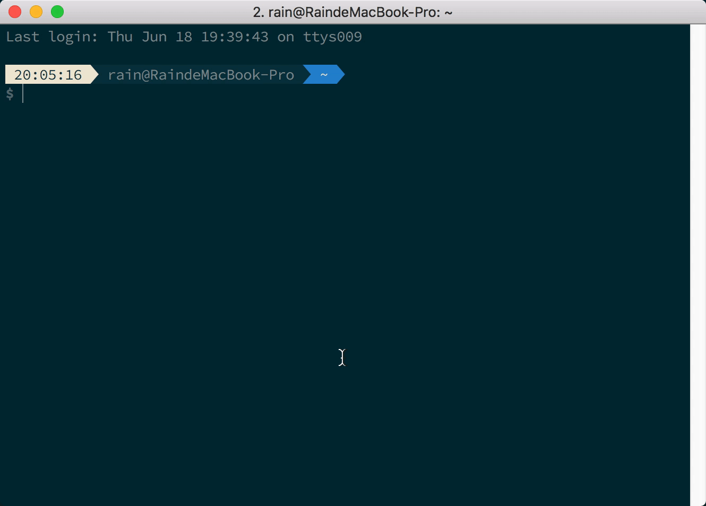
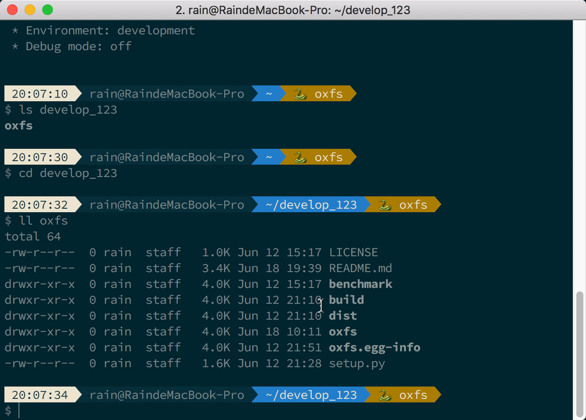
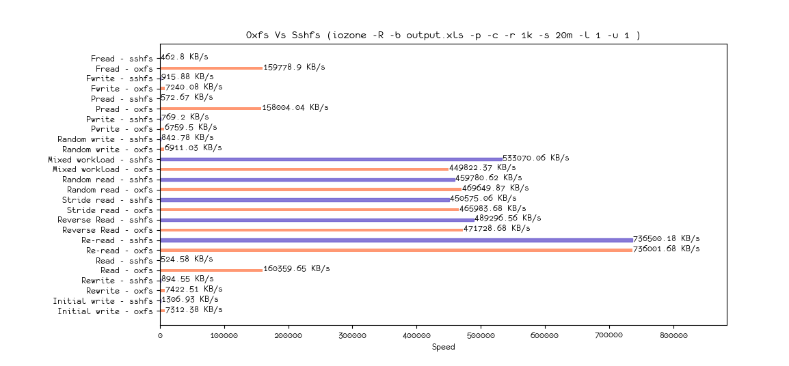

<p align="center">
<h1 align="center">oxfs</h2>
<h6 align="center">A dead simple, fast SFTP file system</h2>
</p>
<p align="center">


</p>

Oxfs is a user-space network file system similar to SSHFS, and the underlying data transfer is based on the SFTP protocol. Oxfs introduces an asynchronous refresh policy to solve the jamming problem caused by the mismatch between network speed and user operation file speed. When Oxfs writes a file, it first writes to the local cache file and submits an asynchronous update task to update the content to the remote host. Similarly, when reading a file, it is preferred to read from a local cache file. Oxfs's data cache eventually falls to disk, and even if it is remounted, the history cache can still be used.





## Get Started

### Install

- Ubuntu/Debian

```sh
$ sudo apt-get install fuse
$ sudo apt-get install python3.7
$ python3.7 -m pip install oxfs --user
```

- MacOS
  - Please install osxfuse firstly. [links](https://github.com/osxfuse/osxfuse/releases)

```sh
$ brew install python3
$ mkdir ~/.venv
$ python3 -m venv ~/.venv/oxfs
$ source ~/.venv/oxfs/bin/activate
$ pip install oxfs
```

### Usage

- Please put your ssh public key to target server's `~/.ssh/authorized_keys`

```sh
# mount
$ oxfs --host mark@x.x.x.x --remote-path /home/mark --mount-point mark --cache-path ~/.oxfs --logging /tmp/oxfs.log --daemon

# browse & edit
$ cd mark

# umount
$ umount mark
```

### Help

```sh
$ oxfs -h
usage: oxfs [-h] [--host HOST] [--ssh-port SSH_PORT]
            [--apiserver-port APISERVER_PORT] [--mount-point MOUNT_POINT]
            [--remote-path REMOTE_PATH] [--cache-path CACHE_PATH]
            [--logging LOGGING] [--daemon] [-v]

optional arguments:
  -h, --help            show this help message and exit
  --host HOST           ssh host (example: root@127.0.0.1)
  --ssh-port SSH_PORT   ssh port (defaut: 22)
  --apiserver-port APISERVER_PORT
                        apiserver port (default: 10010)
  --mount-point MOUNT_POINT
                        mount point
  --remote-path REMOTE_PATH
                        remote path (default: /)
  --cache-path CACHE_PATH
                        cache path
  --logging LOGGING     logging file
  --daemon              daemon
  -v, --verbose         debug info
```

## Benchmark

- VPS: BandwagonHost (SPECIAL 10G KVM PROMO V3 - LOS ANGELES - CN2)
- VPS Operating System: Centos 7 x86_64 bbr
- Host: Intel® Core™ i5-4210U CPU @ 1.70GHz × 4 , SSD 125.5 GB
- Host Operating System: Ubuntu 18.04.2 LTS x86_64 reno
- Network Bandwidth: 4Mbps



## Changelog

- release/0.3.0
  - [New] Add daemon support.
  - [New] Upgrade to flask-restx.
  - [Removed] Remove short argument.
  - [Fixed] Fix bugs with git operations.
  - [Fixed] Fix empty file write failed bug.
  - [Fixed] Fix mount permission issue.
- release/0.2.0
  - [New] Add restful API to refresh the cache.
- release/0.1.2
  - [Removed] Remove auto_unmount fuse parameter, some osxfuse do not support it.
  - [Deprecated] Disable the daemon parameter, turn on it in the future.

- release/0.1.1
  - [Added] enable the auto_cache by default.

- release/0.1.0
  - [Fixed] Fix the multi-thread bugs for rename operation.
